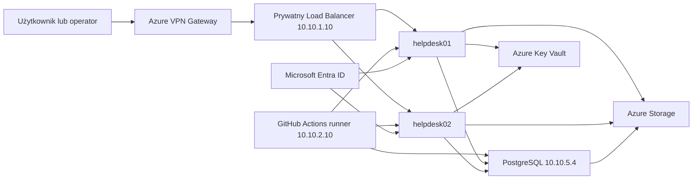

# Sprawozdanie z projektu VKICKHAMSTER Helpdesk

## 1. Cel projektu

Celem projektu było przygotowanie funkcjonalnego środowiska Helpdesk w Microsoft Azure. Rozwiązanie łączy dostęp do usługi wyłącznie przez VPN, automatyzację infrastruktury, bazę danych, kopie zapasowe i podstawowe mechanizmy bezpieczeństwa.

Projekt został przygotowany jako środowisko demonstracyjne, ale wykorzystuje rozwiązania spotykane w systemach produkcyjnych: Infrastructure as Code, segmentację sieci, wysoką dostępność warstwy aplikacyjnej, Managed Identity, Key Vault, platformowe metryki Azure Monitor i przygotowaną konfigurację centralnego monitorowania.

## 2. Zastosowane technologie

| Obszar | Technologia |
|---|---|
| Chmura | Microsoft Azure |
| Infrastruktura | Terraform |
| Konfiguracja serwerów | Ansible |
| System operacyjny | Ubuntu Server 24.04 LTS |
| Aplikacja | Python, Django, Gunicorn |
| Baza danych | PostgreSQL |
| Reverse proxy | Nginx |
| Tożsamość operatorów | Microsoft Entra ID, OpenID Connect |
| Pliki i kopie zapasowe | Azure Blob Storage |
| Sekrety | Azure Key Vault |
| Monitoring | Azure Monitor, Log Analytics |
| Certyfikat | Let's Encrypt |
| Ochrona formularza | Google reCAPTCHA v2 |

## 3. Architektura

Warstwa aplikacyjna składa się z dwóch małych VM `Standard_B1s` za jednym prywatnym Load Balancerem. Formularz i panel operatora są dostępne po zestawieniu VPN. Osobna VM `Standard_B1s` w podsieci zarządzania pełni rolę prywatnego runnera GitHub Actions dla Terraform i Ansible.

PostgreSQL działa na osobnej VM `Standard_B1s` w dedykowanej podsieci. Serwer bazy nie ma publicznego adresu IP.

## 4. Plan adresacji

| Segment | Zakres |
|---|---|
| VNet | 10.10.0.0/16 |
| Aplikacja | 10.10.1.0/24 |
| Zarządzanie | 10.10.2.0/24 |
| GatewaySubnet | 10.10.3.0/24 |
| Zarezerwowana podsieć | 10.10.4.0/26 |
| Baza danych | 10.10.5.0/24 |
| Klienci VPN | 172.20.200.0/24 |

## 5. Routing i zabezpieczenia sieci

Środowisko korzysta z tras systemowych Azure. Trasy `VnetLocal` odpowiadają za komunikację podsieci, a trasa bramy wirtualnej obsługuje klientów Point-to-Site. W projekcie nie ma NVA ani Azure Firewall, dlatego nie zastosowano sztucznej trasy UDR kierującej ruch do nieistniejącego urządzenia.

NSG warstwy aplikacyjnej realizuje następujące zasady:

- SSH tylko z puli VPN i hosta zarządzającego;
- HTTP/HTTPS wyłącznie z VPN przez prywatny Load Balancer;
- sonda Azure Load Balancer na porcie 80;
- PostgreSQL wychodzący wyłącznie do `10.10.5.4:5432`;
- ruch WWW wychodzący tylko na portach 80/443;
- blokada pozostałej komunikacji bocznej w VNet.

NSG bazy danych zezwala na PostgreSQL wyłącznie z podsieci aplikacji oraz na SSH z VPN lub hosta zarządzającego. Pozostały ruch inicjowany z VNet jest blokowany.

Szczegóły znajdują się w `docs/network-security.md`.

## 6. VPN i panel operatora

Azure VPN Gateway udostępnia połączenie Point-to-Site z uwierzytelnianiem certyfikatem. Klient otrzymuje adres z puli `172.20.200.0/24`.

Komputer użytkownika po zestawieniu VPN mapuje nazwę usługi na prywatny adres `10.10.1.10`. Pozwala to zachować prawidłową nazwę certyfikatu HTTPS i URI callbacku Entra ID bez wystawiania Helpdesk do Internetu.

Ansible automatyzuje dodanie konta do grupy operatorów Microsoft Entra ID. Dostęp sieciowy do panelu wymaga wcześniej przygotowanego hosta operatora z zainstalowanym profilem Azure VPN Client oraz certyfikatem klienta. Podczas prezentacji połączenie VPN jest zestawiane z takiego zdalnego hosta.

Brak publicznego frontendu Load Balancera i reguł NSG z Internetu blokuje dostęp do całej usługi bez VPN. Samo poznanie nazwy panelu nie wystarcza do jego otwarcia.

## 7. Aplikacja Helpdesk

Formularz dostępny po VPN umożliwia podanie adresu e-mail, tytułu, opisu, priorytetu i załącznika. Przed zapisem użytkownik potwierdza pole Google reCAPTCHA v2, co ogranicza automatyczne wysyłanie zgłoszeń. Token jest sprawdzany po stronie Django, a prywatny klucz reCAPTCHA pozostaje w Azure Key Vault. Zgłoszenie jest zapisywane w PostgreSQL, a załącznik trafia do prywatnego kontenera Azure Storage.

Panel operatora umożliwia:

- wyświetlanie i filtrowanie zgłoszeń;
- otwieranie szczegółów zgłoszenia;
- przypisanie operatora;
- zmianę statusu i priorytetu;
- dodawanie komentarzy wewnętrznych;
- utworzenie nowego zgłoszenia;
- wylogowanie operatora.

Operatorzy logują się przez Microsoft Entra ID. Dostęp otrzymują wyłącznie członkowie grupy `VKICKHAMSTER Helpdesk Operators`. Awaryjne konto lokalne może być użyte, gdy Entra ID jest niedostępne.

W interfejsie operator jest prezentowany przy użyciu imienia i nazwiska z Entra ID. Techniczny identyfikator konta jest wykorzystywany wyłącznie jako wartość rezerwowa.

## 8. Baza danych i kopie zapasowe

PostgreSQL działa w prywatnej podsieci. Parametry pamięci zostały ograniczone dla VM z 1 GB RAM. Dostęp sieciowy do portu 5432 mają wyłącznie serwery aplikacyjne.

Backup wykonywany jest codziennie przez timer systemd. Skrypt tworzy `pg_dump`, wysyła go do prywatnego kontenera `backups` w Azure Storage, usuwa kopię lokalną i utrzymuje 14-dniową retencję. Dostęp do Storage odbywa się przez Managed Identity, bez kluczy zapisanych na serwerze.

## 9. Sekrety i certyfikaty

Hasło bazy, klucz Django, hasło awaryjnego administratora i sekret klienta Entra są przechowywane w Azure Key Vault. VM odczytują je przez System Assigned Managed Identity.

Nginx obsługuje HTTPS z certyfikatem Let's Encrypt. Jeden backend odnawia certyfikat, zapisuje go w prywatnym Storage, a oba serwery synchronizują wspólną kopię.

## 10. Automatyzacja

Terraform zarządza zasobami Azure i stanem zdalnym. Ansible odpowiada za instalację oraz konfigurację Nginx, Django, PostgreSQL, HTTPS i backupu.

Oba narzędzia są uruchamiane przez GitHub Actions na prywatnym runnerze w Azure. Dzięki temu komputer prezentującego nie wymaga WSL, a runner ma prywatną łączność z serwerami.

Najważniejsze zasady automatyzacji:

- plan Terraform jest analizowany przed wdrożeniem;
- kod aplikacji może zostać wdrożony bez migracji bazy;
- playbooki są idempotentne;
- sekrety nie są przechowywane w repozytorium;
- komentarze w plikach konfiguracji opisują cel najważniejszych elementów.

## 11. Testy odbiorcze

Po wdrożeniu wykonano następujące testy:

| Test | Wynik |
|---|---|
| Helpdesk bez VPN | niedostępny |
| Formularz HTTPS przez VPN | poprawny |
| Panel operatora przez VPN | 302 do logowania |
| Entra ID przez VPN | 302 do Microsoft Login |
| SSH/Ansible do wszystkich VM | poprawny |
| Połączenie obu backendów z PostgreSQL | poprawne |
| Usługi Django, Nginx i PostgreSQL | aktywne |
| DNS z wszystkich VM | poprawny |
| HTTPS wychodzący z wszystkich VM | poprawny |
| reCAPTCHA obecna w formularzu | poprawna |
| Formularz bez tokenu reCAPTCHA | odrzucony |
| Testy Django | 16/16 |
| Końcowy plan Terraform | No changes |

Testy sieciowe po zmianach NSG nie wprowadzały danych do produkcyjnej bazy.

## 12. Kosztorys

Starszy kosztorys `353,34 USD` miesięcznie nie opisuje finalnej architektury. Aktualna kalkulacja powinna obejmować cztery maszyny B1s, cztery dyski, VPN Gateway, jeden prywatny Load Balancer, trzy publiczne IP, Storage i Monitor. Nie obejmuje już Bastiona, Traffic Managera ani publicznego Load Balancera.

Największym wymaganym kosztem stałym pozostaje VPN Gateway. VM `Standard_B1s` są oszczędne, a host zarządzający może zostać deallokowany poza wdrożeniami.

Metoda przygotowania kosztorysu znajduje się w `docs/cost-estimate.md`. Dane CSV są generowane lokalnie i ignorowane przez Git.

## 13. Ograniczenia i dalszy rozwój

- brak dedykowanej domeny; używana jest bezpłatna nazwa Azure;
- brak Azure Firewall/NVA, dlatego routing opiera się na trasach systemowych i NSG;
- VPN Gateway generuje wymagany koszt stały;
- PostgreSQL działa na pojedynczej VM i nie zapewnia wysokiej dostępności bazy;
- system powiadomień e-mail nie został jeszcze dodany;
- raport kosztów wymaga aktywnej sesji Azure CLI.

Możliwe rozszerzenia to powiadomienia e-mail, SLA zgłoszeń, historia audytowa, dashboard operatora, alerty Azure Monitor, prywatne endpointy Storage/Key Vault i automatyczne testy CI.

## 14. Podsumowanie

Projekt realizuje kompletny przepływ: użytkownik po VPN wysyła zgłoszenie, dane trafiają do PostgreSQL i Azure Storage, a uprawniony operator loguje się przez Entra ID i obsługuje zgłoszenie. Infrastruktura, konfiguracja, bezpieczeństwo i kopie zapasowe są odtwarzalne z repozytorium.

## 15. Demonstracja dzialajacego projektu

Podczas prezentacji system może zostać pokazany jako aktywne środowisko. Autor zestawia VPN, wysyła zgłoszenie, loguje operatora przez Entra ID, obsługuje ticket, uruchamia weryfikację Ansible w GitHub Actions i pokazuje plan Terraform zakończony komunikatem `No changes`.

Workflow `management-vm-control.yml` pokazuje kontrolę kosztów przez status, uruchomienie lub deallokację VM runnera. Operatorami można zarządzać idempotentnym playbookiem `ansible/manage-operator.yml`. Żaden krok prezentacyjny nie wykonuje `terraform apply` bez osobnej zgody i zatwierdzenia.
